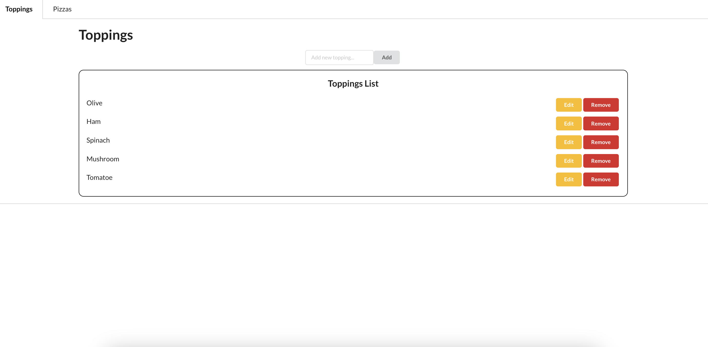
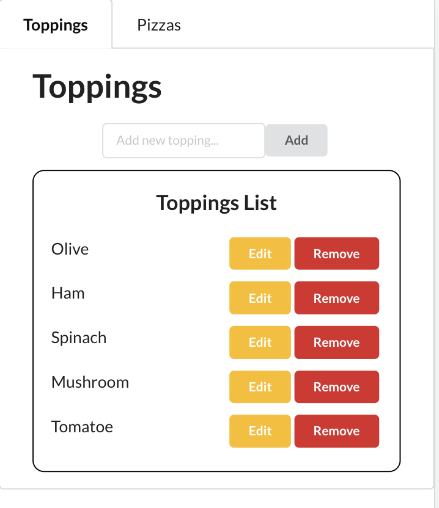
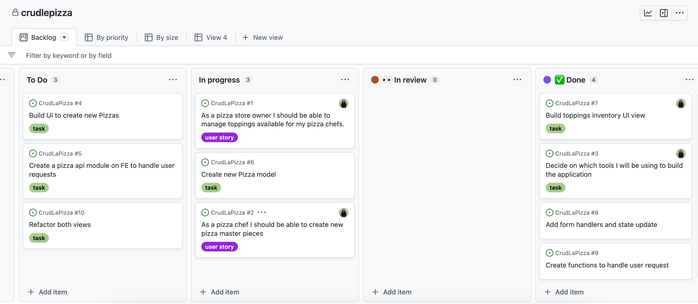

# CrudLaPizza :pizza:

CrudLaPizza is a CRUD application built with React, TypeScript , Node.js and MongoDB.  

## How to run it locally:

:small_orange_diamond: In your local machine clone the repository:  
`git clone https://github.com/cibellem/CrudLaPizza.git`

:small_orange_diamond: Install the node packages:  
`npm run install`

:small_orange_diamond: Run the development server:  
`npm run start`

## Demo/Live application:

https://crudlapizzafe.onrender.com/  
  
  
  

## Future Improvements/Ideas:

Refactor! Refactor! Refactor!  
Forms in the front end could be reusable  
Context API to avoid extra API calls  
Better error handling  

## Developer Notes:

I deployed this application on Render which is a good replacement for Heroku, since the last one it's not longer free. It was very seamless and straighforward.  
I learned a little bit more about Github projects and how to leverage it to keep track of your work when other tools are not available.  

For simplicity I used React Semantic UI to .  
